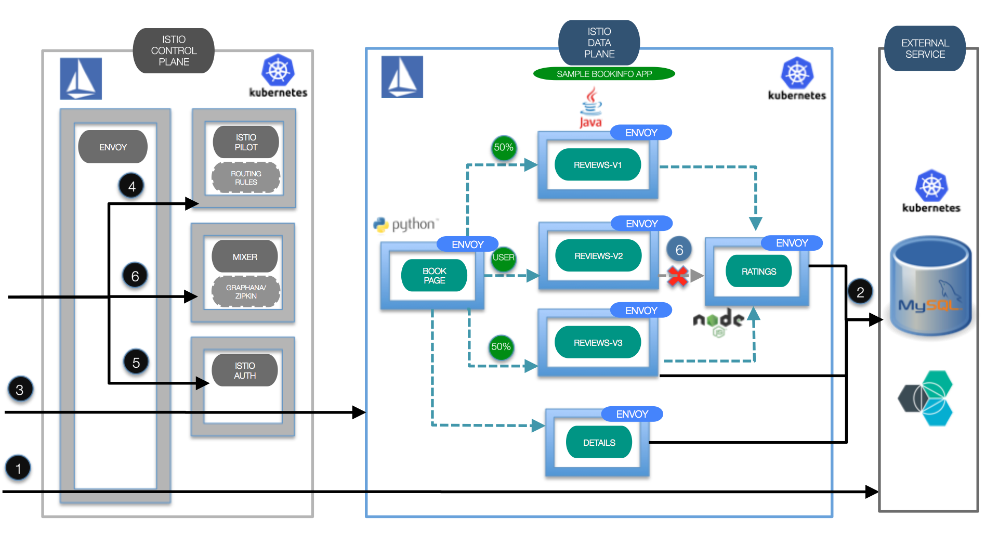
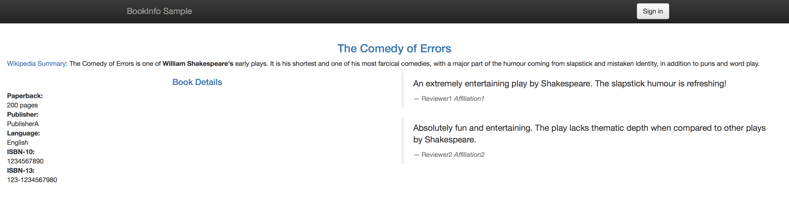
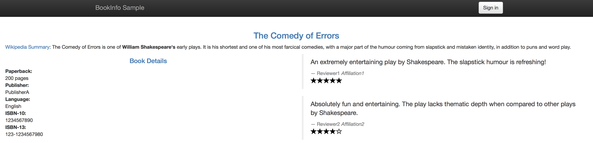
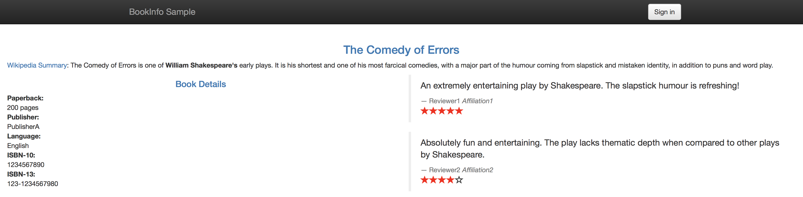
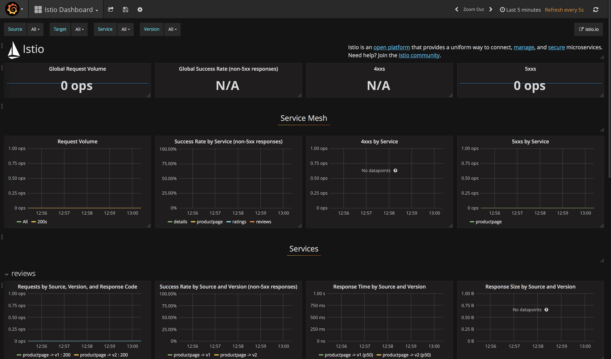
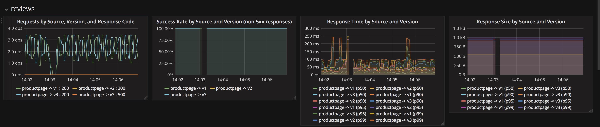
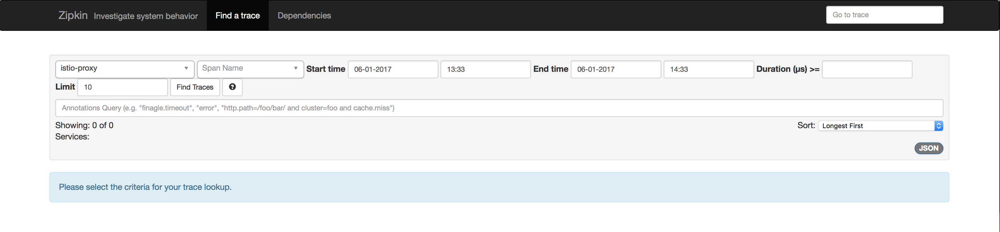
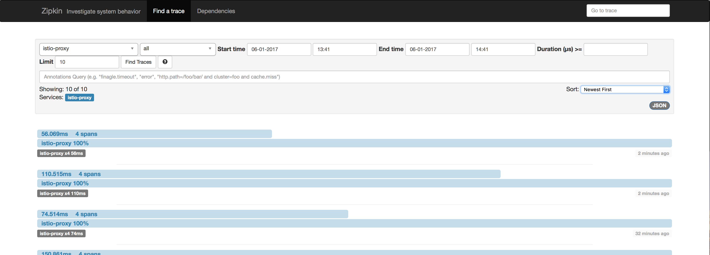
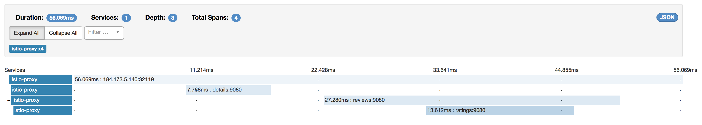
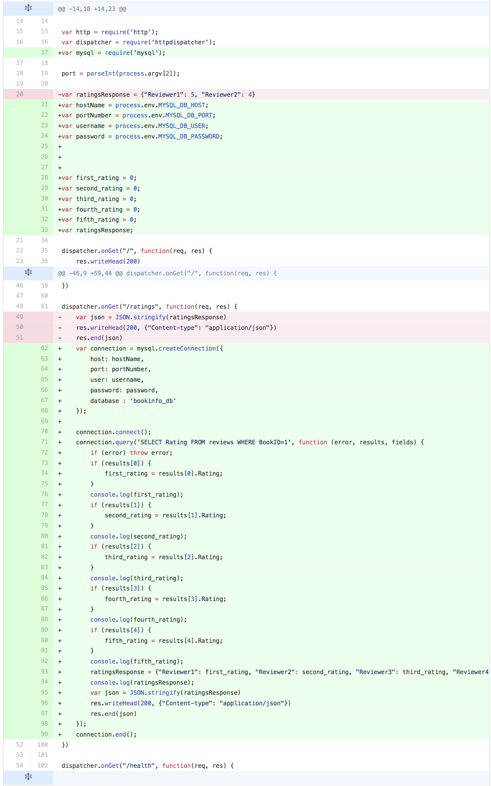

[](https://travis-ci.org/IBM/microservices-traffic-management-using-istio)


# Istio: Microservices의 트래픽 관리

*다른 언어로 보기: [English](README.md).*

마이크로서비스와 컨테이너는 애플리케이션 설계와 배치 패턴의 변화를 가져왔습니다. 그러나, 그로 인해 서비스 디스커버리, 라우팅, 오류 처리 그리고 마이크로서비스에 대한 가시성 등을 해결해야 하는 문제도 발생했습니다. "서비스 메쉬"는 이러한 부분들을 다루기 위해 태어난 아키텍처입니다. 애플리케이션은 내부적으로 마이크로서비스로서 분리되고, 이러한 마이크로서비스들을 서로 연결하는 것에 대한 역할이 서비스 메쉬로 넘겨졌습니다.

[Istio](https://istio.io/)는 IBM, Google 및 Lyft간의 공동 협력체로서, 위와 같은 복잡한 작업에 대한 많은 부분을 자동으로 관리하는 서비스 메쉬를 마이크로서비스들의 변경 없이 쉽게 구성하는 방법을 제공합니다. Istio는 다음과 같이 동작합니다:

1. 전반적인 네트워크 인프라의 관리 및 devops 팀이 정의한 정책과 트래픽 규칙 적용을 강제하는 **컨트롤 플레인(Control Plane)** 을 배포합니다.

2. 마이크로서비스의 각 인스턴스 옆에서 모든 수신 및 발신 네트워크 트래픽을 가로채는 프록시 역할의 보조 컨테이너인 "사이드카(Sidecar)"를 포함하고 있는 **데이터 플레인(Data Plane)** 을 배치합니다. 사이드카는 고성능 오픈소스 프록시(proxy)인 Envoy로 구현됩니다.

Istio의 설치에는 다음과 같은 것을 사용할 수 있는 주요 요소가 포함됩니다.

- **Istio Pilot**을 사용한 트래픽 관리 : Istio Pilot은 컨텐츠 및 정책 기반의 로드 밸런싱 및 라우팅을 제공할 뿐만 아니라 메쉬에 있는 서비스를 나타내는 표준화된 형식으로 관리합니다.

- **Istio Auth**를 사용한 접근 제어 : Istio Auth는 서비스 간 통신을 보장하고 키와 인증서를 관리하는 키 관리 시스템도 제공합니다.

- **Istio Mixer**를 사용한 모니터링, 레포팅 및 할당량 관리 : Istio Mixer는 요청 추적 수집뿐만 아니라 마이크로서비스에 대한 상세한 모니터링 및 로그 데이터 수집 기능을 제공합니다. 서비스 소비자가 화이트 리스트에 있는지 여부를 확인하는 사전 검사나 속도 제한과 같은 할당량 관리 등도 Mixer를 사용하여 구성됩니다.

이 과정의 [첫 번째 부분](#파트-a-예제-bookinfo-애플리케이션을-배포하고-istio-사이드-카를-주입하여-트래픽-흐름-관리-접근-정책-및-애플리케이션에-대한-모니터링-데이터-집계-활성화하기)에서는 예제 [BookInfo](https://istio.io/docs/samples/bookinfo.html) 애플리케이션을 배포하고 사이드카를 주입하여 위에서 언급한 Istio 기능을 얻는 방법을 보여주고 핵심 기술을 살펴 봅니다. BookInfo는 각각 서로 다른 언어로 작성된 4 개의 마이크로서비스(Python, Java, Ruby 및 Node.js)로 구성된 간단한 애플리케이션입니다. 애플리케이션은 데이터베이스를 사용하지 않으며 모든 것을 로컬 파일 시스템에 저장합니다.

또한 Istio는 앞서 언급한 이점을 위해 트래픽 라우팅을 엄격하게 제어하므로 몇 가지 단점을 가지고 있습니다. Istio 데이터 플레인 밖에 있는 외부 서비스로 나가는 트래픽의 경우 외부 서비스 연결에 사용되는 프로토콜을 기반으로하는 특수 구성을 통해서만 활성화 될 수 있습니다.

과정의 [두 번째 부분](#파트-b-외부-데이터-소스를-사용하도록-예제-애플리케이션을-수정하고-애플리케이션-및-egress-트래픽이-활성화-된-istio-envoy-배포하기)에서는 애플리케이션이 외부 서비스에 연결할 수 있도록 Istio를 구성하는 방법에 중점을 둡니다. 이를 위해 예제 BookInfo 애플리케이션을 수정하여 외부 데이터베이스를 사용하며, 이를 기초로 Egress 트래픽을 사용하는 Istio 구성을 보여줍니다.



## 포함된 구성요소
- [Istio](https://istio.io/)
- [Kubernetes 클러스터](https://console.ng.bluemix.net/docs/containers/cs_ov.html#cs_ov)
- [Grafana](http://docs.grafana.org/guides/getting_started)
- [Zipkin](http://zipkin.io/)
- [Prometheus](https://prometheus.io/)
- [Bluemix DevOps Toolchain 서비스](https://console.ng.bluemix.net/catalog/services/continuous-delivery)

# 전제 조건
로컬 테스트를 위해 [Minikube](https://kubernetes.io/docs/getting-started-guides/minikube)를 사용하거나, 클라우드 배치를 위해 [IBM Cloud Private](https://github.com/IBM/deploy-ibm-cloud-private/blob/master/README.md)나 [IBM Bluemix Container Service](https://github.com/IBM/container-journey-template/blob/master/README.md)를 사용하여 쿠버네티스 클러스터를 생성하십시오. 이곳의 코드는 [Bluemix Container 서비스의 쿠버네티스 클러스터](https://console.ng.bluemix.net/docs/containers/cs_ov.html#cs_ov)에 대해 Travis를 사용하여 정기적으로 테스트됩니다.

이 저장소를 복제하고 Istio를 다운로드할 작업 디렉토리를 만드십시오:

```bash
$ mkdir ibm
$ cd ibm
$ git clone https://github.com/IBM/traffic-management-for-your-microservices-using-istio.git demo
```

쿠버네티스 클러스터 위에 Istio 서비스 메쉬가 설치되어 있어야 합니다.
다음과 같은 단계로 설치합니다 (다운로드 한 버젼에 맞춰 변경 하세요):

```bash
$ curl -L https://git.io/getLatestIstio | sh -
$ mv istio-0.7.1 istio
$ export PATH=$PWD/istio/bin:$PATH
$ kubectl apply -f istio/install/kubernetes/istio.yaml

```

# 단계

### 파트 A : 예제 Bookinfo 애플리케이션을 배포하고 Istio 사이드 카를 주입하여 트래픽 흐름 관리, 접근을 정책 및 애플리케이션에 대한 모니터링 데이터 집계 활성화하기

1. [Istio 사이드카가 주입 된 예제 BookInfo 애플리케이션 배포하기](#1-istio-사이드카가-주입-된-예제-bookinfo-애플리케이션-배포하기)
2. [트래픽 흐름 구성하기](#2-istio-pilot을-사용하여-트래픽-흐름-관리하기---서비스-경로-수정)
3. [접근 제어 구성하기](#4-istio-mixer를-사용하여-정책-시행에-접근하기---접근-제어-구성)
4. [메트릭, 로그 추적 범위 수집하기](#4-istio-mixer를-사용하여-원격-측정-데이터-집계하기---메트릭-로그-및-추적-범위-수집)
     - 4.1 [Prometheus 및 Grafana를 사용하여 메트릭 및 로그 수집하기](#41-prometheus-및-grafana를-사용하여-메트릭-및-로그-수집하기)
     - 4.2 [Zipkin을 사용하여 요청 추적 수집하기](#42-zipkin을-사용하여-요청-추적-수집하기)

### 파트 B : 외부 데이터 소스를 사용하도록 예제 애플리케이션을 수정하고, 애플리케이션 및 Egress 트래픽이 활성화 된 Istio Envoy 배포하기
5. [애플리케이션에 대한 외부 데이터 소스 만들기](#5-애플리케이션에-대한-외부-데이터-소스-만들기)
6. [외부 애플리케이션을 수정하여 외부 데이터베이스 사용하기](#6-외부-애플리케이션을-수정하여-외부-데이터베이스-사용하기)
7. [Egress 트래픽이 활성화 된 애플리케이션 마이크로서비스 및 Istio Envoy 배포하기](#7-egress-트래픽이-활성화-된-애플리케이션-마이크로서비스-및-istio-envoy-배포하기)

## Part A: 예제 Bookinfo 애플리케이션을 배포하고 Istio 사이드 카를 주입하여 트래픽 흐름 관리, 접근 정책 및 애플리케이션에 대한 모니터링 데이터 집계 활성화하기

## 1. Istio 사이드카가 주입 된 예제 BookInfo 애플리케이션 배포하기

이 파트에서는 Istio 코드에서 기본적으로 제공되는 예제 BookInfo 애플리케이션을 사용할 것입니다. 위에서 언급했듯이, 이 애플리케이션은 Python, Java, Ruby 및 Node.js의 서로 다른 언어로 작성된 4 개의 마이크로서비스로 구성된 애플리케이션입니다. 기본적으로 이 애플리케이션은 데이터베이스를 사용하지 않으며 모든 마이크로서비스는 로컬 파일 시스템에 데이터를 저장합니다.
Envoy는 각 마이크로서비스에 사이드카로 배치됩니다. Envoy를 마이크로서비스에 주입한다는 것은 Envoy 사이드카가 서비스에 대한 들어오고 나가는 연결을 관리한다는 것을 의미합니다. 기존 마이크로서비스 구성에 Envoy 사이드카를 주입하려면 다음과 같이 하십시오:

```bash
$ kubectl apply -f <(istioctl kube-inject -f istio/samples/bookinfo/kube/bookinfo.yaml)
```

> `istioctl kube-inject`는 _-f_ 로 전달 된 yaml 파일을 수정합니다. 이는 Envoy 사이드카를 쿠버네티스 리소스 구성으로 주입합니다. 변경되는 리소스는 Job, DaemonSet, ReplicaSet 및 Deployment 뿐입니다. YAML 파일 구성의 다른 리소스는 변경되지 않은 상태로 남게됩니다.

몇 분 후, 쿠버네티스 Pod의 마이크로서비스 옆에서 실행되는 각자의 Envoy 사이드카를 볼 수 있게 됩니다. 해당 마이크로서비스는 **productpage, details, ratings, 및 reviews**입니다. reviews 마이크로서비스는 세 가지 버전을 갖게됩니다.
```
$ kubectl get pods

NAME                                        READY     STATUS    RESTARTS   AGE
details-v1-1520924117-48z17                 2/2       Running   0          6m
productpage-v1-560495357-jk1lz              2/2       Running   0          6m
ratings-v1-734492171-rnr5l                  2/2       Running   0          6m
reviews-v1-874083890-f0qf0                  2/2       Running   0          6m
reviews-v2-1343845940-b34q5                 2/2       Running   0          6m
reviews-v3-1813607990-8ch52                 2/2       Running   0          6m
```
애플리케이션에 접근하려면 애플리케이션의 공용 IP 주소를 확인합니다. `bookinfo.yaml`파일에서 ingress 자원을 설정했으므로 다음 명령을 실행합니다:

```bash
$ kubectl get ingress -o wide
```
결과물은 아래와 같습니다
```bash
NAME      HOSTS     ADDRESS                 PORTS     AGE
gateway   *         184.211.10.121          80        1d
```
환경 변수를 설정합니다 (여러분 결과물로 변경하세요):
```bash
export GATEWAY_URL=184.xxx.xxx.xxx:80
```
이제, 다음 주소로 애플리케이션에 접근 할 수 있습니다:`http://${GATEWAY_URL}/productpage`

페이지를 여러 번 새로 고치면 페이지의 _reviews_ 영역이 변경된 것을 볼 수 있습니다. **reviews** 서비스에는 3 가지 버전의 _(reviews-v1, reviews-v2, reviews-v3)_ 배포가 있기 때문입니다. Istio의 로드 밸런서는 라운드 로빈 알고리즘을 사용하여 이 서비스의 세 가지 인스턴스를 반복합니다





## 2. Istio Pilot을 사용하여 트래픽 흐름 관리하기 - 서비스 경로 수정

이 영역에서는 Istio가 애플리케이션의 일부 구성 요소 사이에 대한 네트워크 트래픽을 동적으로 수정하도록 구성합니다. 이 경우 2 가지 버전의 "reviews" 구성 요소 (v1 및 v2)가 있지만 reviews-v1을 reviews-v2로 즉각 대체하고 싶지는 않습니다. 대부분의 경우, 구성 요소가 업그레이드 될 때 새로운 버젼을 네트워크 트래픽의 일부만 라우팅 되도록 배포하며, 이는 이전 버전 삭제 전에 새로운 버젼을 테스트 하기에 유용합니다. 이를 종종 "카나리아 테스트"라고 부릅니다.

이와 같은 경로 제어 방법은 여러 가지가 있습니다. 어떤 사용자가 접근하는지를 기준으로 할 수 있도 있고, 하나의 버전에 트래픽의 특정 비율로 전달되도록  구성할 수도 있습니다.

이 단계에서는 가중치와 HTTP 헤더를 기반으로 서비스 요청이 전달될 곳을 구성하는 방법을 보여줍니다. 전제 조건 영역에서 다운로드 했던 Istio release의 최상위 디렉토리에 접근 하십시오.

* 모든 마이크로서비스에 대한 기본 경로를 `reviews-v1`으로 설정하십시오  

이는 서비스(`destination: <service>` 라인에 표시되어 있는)의 모든 수신 트래픽을 `version: v1` 태그가 설정된 deployment로 지정되도록 합니다. 기본 경로 설정을 위해 다음을 실행하십시오:

  ```bash
  $ istioctl create -f istio/samples/bookinfo/kube/route-rule-all-v1.yaml
  ```

* 특정 사용자에 대해 **reviews 마이크로서비스** 중 `reviews-v2`로  경로 설정하십시오  

이는 사용자 jason(웹 애플리케이션에서 아무 비밀번호로나 jason으로 로그인 할 수 있습니다)에 대해 reviews 마이크로서비스 중  `version: v2`를 볼 수 있도록 경로를 설정합니다. 다음을 실행 하십시오:

  ```bash
  $ istioctl create -f istio/samples/bookinfo/kube/route-rule-reviews-test-v2.yaml
  ```

* **reviews 마이크로서비스** 에 대한 트래픽의 50%를 `reviews-v1`에 나머지 50%를 `reviews-v3`에 전달되도록 경로를 설정하십시오.  

이는 yaml 파일의 `weight: 50`로 나타내어 집니다.

  > `replace`를 사용하여 기존 경로-규칙(route-rules)를 수정할 수 있습니다.

  ```bash
  $ istioctl replace -f istio/samples/bookinfo/kube/route-rule-reviews-50-v3.yaml

  ```

* **reviews 마이크로서비스** 에 대한 100%의 트래픽을 `version: v3`에 전달되도록 설정하십시오.  

이렇게하면 모든 수신 트래픽을 reviews 마이크로서비스의 v3 버전으로 설정할 수 있습니다. 다음을 실행하십시오:

  ```bash
  $ istioctl replace -f istio/samples/bookinfo/kube/route-rule-reviews-v3.yaml
  ```

## 3. Istio Mixer를 사용하여 정책 시행에 접근하기 - 접근 제어 구성

이 단계에서는 서비스에 대한 접근 제어 ​​방법에 대해 보여줍니다. 위의 단계를 완료했다면 `productpage`의 리뷰 영역에 빨간색 별표가 표시되고 _jason_ 으로 로그인하면 검정색 별표가 표시됩니다. `ratings` 서비스는 _jason_ 으로 로그인 한 경우 `reviews-v2`에서 접근되며, jason으로 로그인하지 않은 경우 `reviews-v3`로 접근합니다.

* `reviews-v3`에서 오는 트래픽으로부터 rating 서비스에 대한 접근을 거부하려면 `istioctl mixer rule create`를 사용하십시오

  ```bash
  $ istioctl create -f istio/samples/bookinfo/kube/mixer-rule-ratings-denial.yaml
  ```

* 규칙이 적용되었는지 확인하려면 브라우저로 BookInfo 애플리케이션에 접근하십시오. 검은색 별을 볼 수 있는 _jason_ 으로 로그인 하기 전까지 review 영역에서 어떤 별표 평점도 표시되지 않습니다. (왜냐하면 [단계 2](#2-istio-pilot을-사용하여-트래픽-흐름-관리하기---서비스-경로-수정)에서 완료했던 reviews-v2를 사용하고 있기 때문입니다)


## 4. Istio Mixer를 사용하여 원격 측정 데이터 집계하기 - 메트릭, 로그 및 추적 범위 수집

### 4.1 Prometheus 및 Grafana를 사용하여 메트릭 및 로그 수집하기

이 단계에서는 클러스터의 서비스에 대한 원격 측정 정보를 수집하도록 [Istio Mixer](https://istio.io/docs/concepts/policy-and-control/mixer.html)를 구성하는 방법을 보여줍니다.

* 클러스터에 필요한 Istio 애드-온을 설치하십시오: [Prometheus](https://prometheus.io) 및 [Grafana](https://grafana.com)
  ```bash
  $ kubectl apply -f istio/install/kubernetes/addons/prometheus.yaml
  $ kubectl apply -f istio/install/kubernetes/addons/grafana.yaml
  ```
* **Grafana** 대시보드가 준비되었는지 확인하십시오. `bx cs workers <your-cluster-name>`로 클러스터의 IP를 얻고 `kubectl get svc | grep grafana`로 Grafana 서비스의 NodePort를 얻거나 아래 명령으로 두 가지 다 출력할 수 있습니다:

  ```bash
  $ kubectl -n istio-system port-forward $(kubectl -n istio-system get pod -l app=grafana \
  -o jsonpath='{.items[0].metadata.name}') 3000:3000
  ```
  브라우저에서 http://localhost:3000 로 접근하십시오

  대시보드는 다음과 같은 모습입니다:  
  

* 새로운 원격 측정 데이터 수집을 위해 mixer rule을 적용해야 합니다. 이 예제는, reviews 서비스에 대한 응답 크기(Response Size)를 로그로 생성하게 됩니다. YAML 설정 파일은 BookInfo의 sample 폴더에 있습니다.

* [new-metrics-rule.yaml](new-metrics-rule.yaml)에 있는 구성을 사용하여 Istio Mixer에 대한 구성을 생성하십시오
`
  ```bash
  $ istioctl create -f demo/new_telemetry.yaml
  ```

* 브라우저로 `http://${GATEWAY_URL}/productpage`를 여러번 리로딩하여 서비스로 트래픽을 전달하십시오. 또한, 터미널에서 while loop으로 해당 URL에 대한 `curl`을 실행할 수도 있습니다.

  ```bash
  $ for i in {1..5}; do echo -n .; curl -s http://${GATEWAY_URL}/productpage > /dev/null; done
  ```

* Grafana 대시보드로 다시 가서 새로운 측정 정보가 수집되는지 확인하십시오. 가장 오른쪽에 있는 그래프가 채워져야 합니다.



* 로그 스트림이 생성되어 요청에 대응해 발생하는지 확인하십시오.

  ```bash
  $ kubectl -n istio-system logs $(kubectl -n istio-system get pods -l istio=mixer -o jsonpath='{.items[0].metadata.name}') mixer | grep \"instance\":\"newlog.logentry.istio-system\"

  {"level":"warn","ts":"2017-09-21T04:33:31.249Z","instance":"newlog.logentry.istio-system","destination":"details","latency":"6.848ms","responseCode":200,"responseSize":178,"source":"productpage","user":"unknown"}
  ...
  ...
  ...
  ```

[Istio에서 메트릭 및 로그 수집하기](https://istio.io/docs/tasks/telemetry/metrics-logs.html)

### 4.2 Zipkin을 사용하여 요청 추적 수집하기

이 단계에서는 [Zipkin](http://zipkin.io)을 사용하여 추적 기간(trace spans)을 수집하는 방법을 보여줍니다.
* 필요한 Istio 애드-온을 설치하십시오: [Zipkin](http://zipkin.io)

  ```bash
  $ kubectl apply -f istio/install/kubernetes/addons/zipkin.yaml
  ```

* **Zipkin 대시보드**에 접근하십시오. `bx cs workers <your-cluster-name>`로 클러스터의 IP를 얻고 `kubectl get svc | grep zipkin`로 Zipkin 서비스의 NodePort를 얻거나 다음 명령으로 둘 다 얻을 수 있습니다:
  ```bash
  $ kubectl port-forward -n istio-system \
  $(kubectl get pod -n istio-system -l app=zipkin -o jsonpath='{.items[0].metadata.name}') \
  9411:9411
  ```  
  `http://localhost:3000`로 zipkin 대시보드에 접근하십시오

  대시보드는 다음과 같은 모습입니다:
  

* 브라우저에서 `http://${GATEWAY_URL}/productpage`를 여러번 리로드하여 서비스에 트래픽을 보내십시오. 앞에서와 같이 while loop에 `curl`을 호출하는 것을 재사용할 수도 있습니다.

* Zipkin 대시보드에 다시 가면 추적이 완료된 몇 가지를 볼 수 있습니다. _적절한 시작 시간 및 끝 시간을 입력하고 Find Trace 버튼을 클릭하십시오_



* 이와 같은 추적 결과 중 하나를 클릭하면 BookInfo 앱으로 보냈던 트래픽의 상세 정보를 볼 수 있습니다. `productpage`에 대한 요청이 끝나기 까지 시간이 얼마나 걸렸는지 보여줍니다. 또한, `details`,`reviews`, 그리고 `ratings`에 대한 요청도 얼마나 걸렸는지 보여줍니다.



[Istio에서 Zipkin 추적하기](https://istio.io/docs/tasks/telemetry/distributed-tracing.html)

## Part B: 외부 데이터 소스를 사용하도록 예제 애플리케이션을 수정하고, 애플리케이션 및 Egress 트래픽이 활성화 된 Istio Envoy 배포하기

이 단원에서는, 외부 데이터 베이스를 사용하고 egress 트래픽에 대해 Istio envoy를 사용하도록 예제 애플리케이션을 수정합니다. 전제 조건에서 언급 한대로 쿠버네티스 클러스터에 Istio 컨트롤 플레인이 설치되어 있는지 확인하십시오. `처음에 복제했던 소스 코드 저장소인 demo 폴더 밖`에서 이 명령을 실행하게 됩니다.

## 5. 애플리케이션에 대한 외부 데이터 소스 만들기

https://console.ng.bluemix.net/catalog/services/compose-for-mysql 을 통해 Bluemix에 Compose for MySQL을 프로비전 하십시오  
서비스 신임 정보로 이동하고 신임 정보를 확인하십시오. MySQL hostname, port, user, 그리고 password 가 신임 정보의 uri에 있으며 이는 이와 같은 모습입니다


## 6. 외부 애플리케이션을 수정하여 외부 데이터베이스 사용하기

이 단계에서는, 원본 예제 BookInfo 애플리케이션이 MySQL 데이터 베이스를 활용하도록 수정되었습니다. 수정된 마이크로서비스들은 `details`, `ratings`, 그리고 `reviews` 입니다. 이는 애플리케이션에서 Istio 데이터 플레인 밖에 있는 외부 서비스(이 경우에는 데이터 베이스)의 활용을 위한 egress 트래픽 활성화를 Istio가 어떻게 구성하는지 보여주기 위해 진행 되었습니다.

이 단계에서는, [microservices 폴더](/microservices)에 있는 소스로부터 서로 다른 마이크로서비스용 Docker 이미지들를 빌드하거나 주어진 이미지들를 이용할지 선택할 수 있습니다.
> 자신만의 이미지를 빌드하려면 [microservices 폴더](/microservices)로 이동하십시오

다음과 같은 수정 사항들이 원본 BookInfo 애플리케이션에 반영 되었습니다. **details 마이크로서비스**는 Ruby를 사용하며 MySQL 데이터 베이스로 접속하기 위해 `mysql` ruby gem이 추가되었습니다. **ratings 마이크로서비스**는 Node.js를 사용하며 MySQL 데이터 베이스로 접속하기 위해 `mysql` 모듈이 추가되었습니다. **reviews v1,v2,v3 마이크로서비스**들은 Java를 사용하고 MySQL 데이터 베이스로 접속하기 위해 `mysql-connector-java` 의존성이 [build.gradle](/microservices/reviews/reviews-application/build.gradle)에 추가되었습니다. 더 많은 소스 코드가 [details.rb](/microservices/details/details.rb), [ratings.js](/microservices/ratings/ratings.js), [LibertyRestEndpoint.java](/microservices/reviews/reviews-application/src/main/java/application/rest/LibertyRestEndpoint.java)에 추가되어 애플리케이션이 MySQL 데이터 베이스의 details, ratings 및 reviews 데이터를 사용할 수 있게 되었습니다.

MySQL 데이터 베이스에 접근하기 위해 `ratings.js`에 추가된 소스의 미리 보기:



Bluemix Compose에서 제공하는 신임 정보를 포함하도록 `demo/secrets.yaml` 파일을 수정해야 합니다.

> 참고: secrets 파일에서 제공하는 값들은 `base64` 실행을 먼저 통해져야 합니다.

```bash
echo -n <username> | base64
echo -n <password> | base64
echo -n <host> | base64
echo -n <port> | base64
```

```yaml
apiVersion: v1
kind: Secret
metadata:
  name: demo-credentials
type: Opaque
data:
  username: YWRtaW4=
  password: VEhYTktMUFFTWE9BQ1JPRA==
  host: c2wtdXMtc291dGgtMS1wb3J0YWwuMy5kYmxheWVyLmNvbQ==
  port: MTg0ODE=
```

설정된 secrets을 쿠버네티스 클러스터에 추가하십시오:

```bash
$ kubectl apply -f demo/secrets.yaml
```

## 7. Egress 트래픽이 활성화 된 애플리케이션 마이크로서비스 및 Istio Envoy 배포하기

기본적으로, Istio가 적용된 애플리케이션은 클러스터 외부의 URL에 접근할 수 없습니다. pod에서 외부로 나가는 모든 트래픽들은 클러스터 안의 대상만 처리하는 사이드카 프록시에 의해 리다이렉트 됩니다.

Istio가 적용된 클라이언트에게 외부 서비스를 노출하도록 Istio를 설정하는 방법은 두 가지가 있습니다. a. `ExternalService` 설정을 정의 b. 단순하게 특정 IP 범위에 대해 Istio 프록시를 통과하기. 이 과정에서는 IP 범위를 사용합니다.

우리는 재사용 하기 위해 환경 변수에 IP 범위를 저장합니다:

```bash
$ export IPRANGES=172.30.0.0/16,172.20.0.0/16
$ echo $IPRANGES
```

* Bluemix의 MySQL 데이터 베이스에 데이터를 추가하십시오.
> 이는 데이터 베이스 디자인 및 초기값을 추가됩니다.

```bash
$ kubectl apply -f demo/mysql-data.yaml
```

* Envoy가 주입되는 `productpage`와 함께 `gateway`를 배포하십시오.  

```bash
$ kubectl apply -f <(istioctl kube-inject -f demo/bookinfo.yaml)

```
`productpage`는 Egress 트래픽이 없을 것으로 예상되므로 외부 요청을 가로채기 위한 Envoy 구성은 필요 없습니다.

* Envoy가 주입되는 `details` 배포와 함께 Egress 트래픽을 활성화 하십시오.  

```bash
$ kubectl apply -f <(istioctl kube-inject -f demo/details-new.yaml --includeIPRanges=${IPRANGES})
```

* Envoy가 주입되는 `reviews` 배포와 함께 Egress 트래픽을 활성화 하십시오.  

```bash
$ kubectl apply -f <(istioctl kube-inject -f demo/reviews-new.yaml --includeIPRanges=${IPRANGES})
```

* Envoy가 주입되는 `ratings` 배포와 함꼐 Egress 트래픽을 활성화 하십시오.  

```bash
$ kubectl apply -f <(istioctl kube-inject -f demo/ratings-new.yaml --includeIPRanges=${IPRANGES})
```

`details`, `reviews`, `ratings`는 MySQL 데이터 베이스가 클러스터 외부에 있으므로 외부 트래픽을 갖게 됩니다. 그것이 `istioctl kube-inject`에서 `--includeIPRanges` 옵션을 사용하는 이유입니다.

이제 애플리케이션에 접근하여 데이터를 MySQL 데이터 베이스로부터 얻는지 확인해 볼 수 있습니다.
브라우저에서 다음으로 접근하십시오:  
`http://${GATEWAY_URL}/productpage`

# 문제 해결
* 클러스터에서 Istio 삭제하기

```bash
$ kubectl delete -f install/kubernetes/istio.yaml
```

* 모든 애드-온 삭제하기: `kubectl delete -f install/kubernetes/addons`
* BookInfo 애플리케이션과 경로 규칙 삭제하기: `./samples/apps/bookinfo/cleanup.sh`

# 참고
[Istio.io](https://istio.io/docs/tasks/)
# 라이센스
[Apache 2.0](http://www.apache.org/licenses/LICENSE-2.0)
