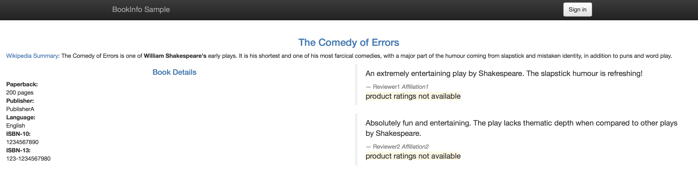

[](https://travis-ci.org/IBM/traffic-management-for-your-microservices-using-istio)


# Istio: Traffic Management for your Microservices

Microservices and containers changed application design and deployment patterns, but along with them brought challenges like service discovery, routing, failure handling, and visibility to microservices. "Service mesh" architecture was born to handle these features. Applications are getting decoupled internally as microservices, and the responsibility of maintaining coupling between these microservices is passed to the service mesh.

[Istio](https://istio.io/), a joint collaboration between IBM, Google and Lyft provides an easy way to create a service mesh that will manage many of these complex tasks automatically, without the need to modify the microservices themselves. Istio does this by:

1. Deploying a **control plane** that manages the overall network infrastructure and enforces the policy and traffic rules defined by the devops team

2. Deploying a **data plane** which includes “sidecars”, secondary containers that sit along side of each instance of a microservice and act as a proxy to intercept all incoming and outgoing network traffic. Sidecars are implmented using Envoy, an open source edge proxy

Once Istio is installed some of the key feature which it makes available include

- Traffic management using **Istio Pilot**: In addition to providing content and policy based load balancing and routing, Pilot also maintains a canonical representation of services in the mesh.

- Access control using **Istio Auth**: Istio Auth controls access to the microservices based on traffic origination points and users, and also provides a key management system to manage keys and certificates

- Monitoring, reporting and quota management using **Istio Mixer**: Istio Mixer provides in depth monitoring and logs data collection for microservices, as well as collection of request traces. Precondition checking like whether the service consumer is on whitelist, quota management like rate limits etc. are also configured using Mixer.

In the [first part](#part-a-deploy-sample-bookinfo-application-and-inject-istio-sidecars-to-enable-traffic-flow-management-access-policy-and-monitoring-data-aggregation-for-application) of this journey we show how can we can deploy the sample [BookInfo](https://istio.io/docs/samples/bookinfo.html) application and inject sidecars to get the Istio features mentioned above, and walk through the key ones. The BookInfo is a simple application that is composed of four microservices, written in different languages for each of its microservices namely Python, Java, Ruby, and Node.js. The application does not use a database, and stores everything in local filesystem.

Also since Istio tightly controls traffic routing to provide above mentioned benefits, it introduces some drawbacks. Outgoing traffic to external services outside the Istio data plane can only be enabled by specialized configuration, based on the protocol used to connect to the external service.

In the [second part](#part-b-modify-sample-application-to-use-an-external-datasource-deploy-the-application-and-istio-envoys-with-egress-traffic-enabled) of the journey we focus on how Istio can be configured to allow applications to connect to external services. For that we modify the sample BookInfo application to use an external database and then use it as a base to show Istio configuration for enabling egress traffic


## Included Components
- [Istio](https://istio.io/)
- [Kubernetes Clusters](https://console.ng.bluemix.net/docs/containers/cs_ov.html#cs_ov)
- [Grafana](http://docs.grafana.org/guides/getting_started)
- [Zipkin](http://zipkin.io/)
- [Prometheus](https://prometheus.io/)
- [Bluemix DevOps Toolchain Service](https://console.ng.bluemix.net/catalog/services/continuous-delivery)

# Prerequisite
Create a Kubernetes cluster with either [Minikube](https://kubernetes.io/docs/getting-started-guides/minikube) for local testing, or with [IBM Bluemix Container Service](https://github.com/IBM/container-journey-template/blob/master/README.md) to deploy in cloud. The code here is regularly tested against [Kubernetes Cluster from Bluemix Container Service](https://console.ng.bluemix.net/docs/containers/cs_ov.html#cs_ov) using Travis.

Create a working directory to clone this repo and to download Istio into:

```bash
$ mkdir ibm
$ cd ibm
$ git clone https://github.com/IBM/Traffic-management-for-your-microservices-using-Istio.git demo
```

You will also need Istio service mesh installed on top of your Kubernetes cluster. On Linux (with kubernetes that has beta RBAC) you can run the following:

_See [here](https://github.com/IBM/Microservices-with-Istio-Service-Mesh-on-Kubernetes/blob/master/GETTING_STARTED.md) for troubleshooting, more detailed instructions, and for
other Operating Systems._

```bash
$ curl -SL https://github.com/istio/istio/releases/download/0.1.6/istio-0.1.6-linux.tar.gz | tar xzf -
$ mv istio-0.1.6 istio
$ sudo cp istio/bin/istioctl /usr/local/bin/
$ kubectl apply -f istio/install/kubernetes/istio-rbac-beta.yaml
$ kubectl apply -f istio/install/kubernetes/istio.yaml

```

# Deploy to Bluemix
If you want to deploy the BookInfo app directly to Bluemix, click on 'Deploy to Bluemix' button below to create a Bluemix DevOps service toolchain and pipeline for deploying the sample, else jump to [Steps](#steps)

> You will need to create your Kubernetes cluster first and make sure it is fully deployed in your Bluemix account.

[](https://console.ng.bluemix.net/devops/setup/deploy/)

Please follow the [Toolchain instructions](https://github.com/IBM/container-journey-template/blob/master/Toolchain_Instructions.md) to complete your toolchain and pipeline.

# Steps

### Part A: Deploy sample Bookinfo application and inject Istio sidecars to enable traffic flow management, access policy and monitoring data aggregation for application

1. [Deploy sample BookInfo application on Kubernetes](#1-deploy-sample-bookinfo-application-on-kubernetes)
2. [Inject Istio envoys on the application](#2-inject-istio-envoys-on-the-application)
3. [Configure Traffic flow](#3-traffic-flow-management-using-istio-pilot---modify-service-routes)
4. [Configure access control](#4-access-policy-enforcement-using-istio-auth---configure-access-control)
5. [Collect metrics, logs and trace spans](#5-telemetry-data-aggregation-using-istio-mixer---collect-metrics-logs-and-trace-spans)
     - 5.1 [Collect metrics and logs using Prometheus and Grafana](#51-collect-metrics-and-logs-using-prometheus-and-grafana)
     - 5.2 [Collect request traces using Zipkin](#52-collect-request-traces-using-zipkin)

### Part B: Modify sample application to use an external datasource, deploy the application and Istio envoys with egress traffic enabled
6. [Create an external datasource for the application](#6-create-an-external-datasource-for-the-application)
7. [Modify sample application to use the external database](#7-modify-sample-application-to-use-the-external-database)
8. [Deploy application microservices and Istio envoys with egress traffic enabled](#8-deploy-application-microservices-and-istio-envoys-with-egress-traffic-enabled)

## Part A: Deploy sample Bookinfo application and inject Istio sidecars to enable traffic flow management, access policy and monitoring data aggregation for application

## 1. Deploy sample BookInfo application on Kubernetes

In this part, we will be using the sample BookInfo Application that comes as default with Istio code base. As mentioned above, the application that is composed of four microservices, written in different languages for each of its microservices namely Python, Java, Ruby, and Node.js. The default application doesn't use a database and all the microservices store their data in the local file system.

* Deploy the BookInfo Application in your Cluster

```bash
$ kubectl apply -f istio/samples/apps/bookinfo/bookinfo.yaml
```

* If are using minikube or you don't have access to external load balancers, you need to use NodePort on the `productpage` service. Run the following command to use a NodePort:

```bash
$ kubectl apply -f demo/node-port.yaml
```

* If you have a load balancer, you find the URL through the IP found on `kubectl get ingress` and skip this step.  Otherwise to show your cluster’s IP address and NotePort of your `productpage` run:

```bash
$ export URL=http://$(kubectl get po -l app=productpage -o jsonpath='{.items[0].status.hostIP}'):$(kubectl get svc productpage -o jsonpath='{.spec.ports[0].nodePort}')
$ echo $URL
http://184.xxx.yyy.zzz:30XYZ
```

At this point, you can point your browser to the provided URL (or run `$ firefox $GRAFANA/dashboard/db/istio-dashboard` if you have firefox installed) and see the BookInfo Application.

The next step would be deploying this sample application with Istio Envoys injected. You should now delete the sample application to proceed to the next step. This is needed at this point because currently Istio doesn't dupport injecting Envoy proxies in an already deployed application, though that's a feature which is in plan.

```bash
$ kubectl delete -f istio/samples/apps/bookinfo/bookinfo.yaml
```

## 2. Inject Istio envoys on the application

> Note: If you did not delete the app from stage 1 you will see issues if you proceed with this stage._

Envoys are deployed as sidecars on each microservice. Injecting Envoy into your microservice means that the Envoy sidecar would manage the ingoing and outgoing calls for the service. To inject an Envoy sidecar to an existing microservice configuration, do:

```bash
$ kubectl apply -f <(istioctl kube-inject -f istio/samples/apps/bookinfo/bookinfo.yaml)
```

> `istioctl kube-inject` modifies the yaml file passed in _-f_. This injects Envoy sidecar into your Kubernetes resource configuration. The only resources updated are Job, DaemonSet, ReplicaSet, and Deployment. Other resources in the YAML file configuration will be left unmodified.

After a few minutes, you should now have your Kubernetes Pods running and have an Envoy sidecar in each of them alongside the microservice. The microservices are **productpage, details, ratings, and reviews**. Note that you'll have three versions of the reviews microservice.
```
$ kubectl get pods

NAME                              READY     STATUS    RESTARTS
details-v1-969129648-lwgr3        2/2       Running   0       
istio-egress-3850639395-30d1v     1/1       Running   0       
istio-ingress-4068702052-2st6r    1/1       Running   0       
istio-pilot-251184572-x9dd4     2/2       Running   0       
istio-mixer-2499357295-kn4vq      1/1       Running   0       
productpage-v1-1629799384-00f11   2/2       Running   0       
ratings-v1-1194835686-dzf2f       2/2       Running   0       
reviews-v1-2065415949-3gdz5       2/2       Running   0       
reviews-v2-2593570575-92657       2/2       Running   0       
reviews-v3-3121725201-cn371       2/2       Running   0       
```
To access your application, you can check the public IP address of your cluster through `kubectl get nodes` and get the NodePort of the istio-ingress service for port 80 through `kubectl get svc | grep istio-ingress`. Or you can also run the following command to output the IP address and NodePort:

```bash
$ export URL=http://$(kubectl get po -l istio=ingress -o jsonpath='{.items[0].status.hostIP}'):$(kubectl get svc istio-ingress -o jsonpath='{.spec.ports[0].nodePort}')
$ echo $URL
184.xxx.yyy.zzz:30XYZ
```

Point your browser to:  
`http://184.xxx.yyy.zzz:30XYZ/productpage` Replace with your own IP and NodePort.

If you refresh the page multiple times, you'll see that the _reviews_ section of the page changes. That's because there are 3 versions of **reviews**_(reviews-v1, reviews-v2, reviews-v3)_ deployment for our **reviews** service. Istio’s load-balancer is using a round-robin algorithm to iterate through the 3 instances of this service


## 3. Traffic flow management using Istio Pilot - Modify service routes

In this section, Istio will be configured to dynamically modify the network traffic between some of the components of our application. In this case we have 2 versions of the “reviews” component (v1 and v2) but we don’t want to replace review-v1 with review-v2 immediately. In most cases, when components are upgraded it’s useful to deploy the new version but only have a small subset of network traffic routed to it so that it can be tested before the old version is removed. This is often referred to as “canary testing”.

There are multiple ways in which we can control this routing. It can be based on which user is accessing it, or certain percentage of the traffic can be configured to flow to one version etc.

This step shows you how to configure where you want your service requests to go based on weights and HTTP Headers.You would need to be in the root directory of the Istio release you have downloaded on the Prerequisites section.

* Set Default Routes to `reviews-v1` for all microservices  

This would set all incoming routes on the services (indicated in the line `destination: <service>`) to the deployment with a tag `version: v1`. To set the default routes, run:

  ```bash
  $ istioctl create -f istio/samples/apps/bookinfo/route-rule-all-v1.yaml
  ```

* Set Route to `reviews-v2` of **reviews microservice** for a specific user  

This would set the route for the user `jason` (You can login as _jason_ with any password in your deploy web application) to see the `version: v2` of the reviews microservice. Run:

  ```bash
  $ istioctl create -f istio/samples/apps/bookinfo/route-rule-reviews-test-v2.yaml
  ```

* Route 50% of traffic on **reviews microservice** to `reviews-v1` and 50% to `reviews-v3`.  

This is indicated by the `weight: 50` in the yaml file.

  > Using `replace` should allow you to edit exisiting route-rules.

  ```bash
  $ istioctl replace -f istio/samples/apps/bookinfo/route-rule-reviews-50-v3.yaml

  ```

* Route 100% of the traffic to the `version: v3` of the **reviews microservices**  

This would set every incoming traffic to the version v3 of the reviews microservice. Run:

  ```bash
  $ istioctl replace -f istio/samples/apps/bookinfo/route-rule-reviews-v3.yaml
  ```

## 4. Access policy enforcement using Istio Auth - Configure access control

This step shows you how to control access to your services. If you have done the step above, you'll see that your `productpage` now just shows red stars on the reviews section and if you are logged in as _jason_, you'll see black stars. The `ratings` service is accessed from the `reviews-v2` if you're logged in as _jason_ or it is accessed from `reviews-v3` if you are not logged in as `jason`.

* To deny access to the ratings service from the traffic coming from `reviews-v3`, you will use `istioctl mixer rule create`

  ```bash
  $ istioctl mixer rule create global ratings.default.svc.cluster.local -f istio/samples/apps/bookinfo/mixer-rule-ratings-denial.yaml
  ```

  The `mixer-rule-ratings-denial.yaml` file creates a rule that denies `kind: denials` access from reviews service and has a label of v3 `selector: source.labels["app"]=="reviews" && source.labels["version"] == "v3"`  
  You can verify using `istioctl mixer rule get global ratings.default.svc.cluster.local` if the mixer rule has been created that way:

  ```bash
  $ istioctl mixer rule get global ratings.default.svc.cluster.local
  rules:
  - aspects:
    - kind: denials
    selector: source.labels["app"]=="reviews" && source.labels["version"] == "v3"
  ```

* To verify if your rule has been enforced, point your browser to your BookInfo Application, you wouldn't see star ratings anymore from the reviews section unless you are logged in as _jason_ which you will still see black stars (because you would be using the reviews-v2 as you have done in [Step 4](#4-modify-service-routes)).




## 5. Telemetry data aggregation using Istio Mixer - Collect metrics, logs and trace spans

### 5.1 Collect metrics and logs using Prometheus and Grafana

This step shows you how to configure [Istio Mixer](https://istio.io/docs/concepts/policy-and-control/mixer.html) to gather telemetry for services in your cluster.

* Install the required Istio Addons on your cluster: [Prometheus](https://prometheus.io) and [Grafana](https://grafana.com)
  ```bash
  $ kubectl apply -f istio/install/kubernetes/addons/prometheus.yaml
  $ kubectl apply -f istio/install/kubernetes/addons/grafana.yaml
  ```
* Verify that your **Grafana** dashboard is ready. Get the IP of your cluster `kubectl get nodes` and then the NodePort of your Grafana service `kubectl get svc | grep grafana` or you can run the following command to output both:

  ```bash
  $ export GRAFANA=http://$(kubectl get po -l app=grafana -o jsonpath='{.items[0].status.hostIP}'):$(kubectl get svc grafana -o jsonpath='{.spec.ports[0].nodePort}')
  $ echo $GRAFANA
  184.xxx.yyy.zzz:30XYZ
  ```
  Point your browser to http://184.xxx.yyy.zzz:30XYZ/dashboard/db/istio-dashboard (or run `$ firefox $GRAFANA/dashboard/db/istio-dashboard` if you have firefox installed) to go directly to your dashboard.  

  Your dashboard should look like this:  
  

* To collect new telemetry data, you will use `istio mixer rule create`. For this sample, you will generate logs for Response Size for Reviews service. The configuration YAML file is provided within the BookInfo sample folder. Validate that your Reviews service has no service-specific rules already applied.

  ```bash
  $ istioctl mixer rule get reviews.default.svc.cluster.local reviews.default.svc.cluster.local
  Error: the server could not find the requested resource
  ```

* Create the configuration on Istio Mixer using the configuration in [new-metrics-rule.yaml](new-metrics-rule.yaml)
`
  ```bash
  $ istioctl mixer rule create reviews.default.svc.cluster.local reviews.default.svc.cluster.local -f demo/new-metrics-rule.yaml
  ```

* Send traffic to that service by refreshing your browser to `http://184.xxx.yyy.zzz:30XYZ/productpage` multiple times. You can also do `curl` on your terminal to that URL in a while loop.

  ```bash
  $ for i in {1..5}; do echo -n .; curl -s $URL/productpage > /dev/null; done
  ```

* Verify that the new metric is being collected by going to your Grafana dashboard again. The graph on the rightmost should now be populated.


* Verify that the logs stream has been created and is being populated for requests

  ```bash
  $ kubectl logs $(kubectl get pods -l istio=mixer -o jsonpath='{.items[0].metadata.name}') | grep \"combined_log\"

  {"logName":"combined_log","labels":{"referer":"","responseSize":871,"timestamp":"2017-04-29T02:11:54.989466058Z","url":"/reviews","userAgent":"python-requests/2.11.1"},"textPayload":"- - - [29/Apr/2017:02:11:54 +0000] \"- /reviews -\" - 871 - python-requests/2.11.1"}
  ...
  ...
  ...
  ```

[Collecting Metrics and Logs on Istio](https://istio.io/docs/tasks/metrics-logs.html)

### 5.2 Collect request traces using Zipkin

This step shows you how to collect trace spans using [Zipkin](http://zipkin.io).
* Install the required Istio Addon: [Zipkin](http://zipkin.io)

  ```bash
  $ kubectl apply -f istio/install/kubernetes/addons/zipkin.yaml
  ```

* Access your **Zipkin Dashboard**. Get the IP of your cluster `kubectl get nodes` and then the NodePort of your Zipkin service `kubectl get svc | grep zipkin` or you can run the following command to output both:
  ```bash
  $ ZIPKIN=http://$(kubectl get po -l app=zipkin -o jsonpath='{.items[0].status.hostIP}'):$(kubectl get svc zipkin -o jsonpath='{.spec.ports[0].nodePort}')
  $ echo $ZIPKIN
  184.xxx.yyy.zzz:30XYZ
  ```  
  Your dashboard should like this:
  

* Send traffic to that service by refreshing your browser to `http://184.xxx.yyy.zzz:30XYZ/productpage` multiple times. You can also do reuse the `curl` for loop from earlier.

* Go to your Zipkin Dashboard again and you will see a number of traces done. _Click on Find Traces button with the appropriate Start and End Time_


* Click on one of those traces and you will see the details of the traffic you sent to your BookInfo App. It shows how much time it took for the request on `productpage` to finish. It also shows how much time it took for the requests on the `details`,`reviews`, and `ratings` services.


[Zipkin Tracing on Istio](https://istio.io/docs/tasks/zipkin-tracing.html)

## Part B:  Modify sample application to use an external datasource, deploy the application and Istio envoys with egress traffic enabled

#### This part requires you to be in the root directory of this repository to use the YAML files and/or source code for the microservices.
```bash
cd demo
```

## 6. Create an external datasource for the application

Provision Compose for MySQL in Bluemix via https://console.ng.bluemix.net/catalog/services/compose-for-mysql  
Go to Service credentials and view your credentials. Your MySQL hostname, port, user, and password are under your credential uri and it should look like this


## 7. Modify sample application to use the external database

In this step, the original sample BookInfo Application is modified to leverage a MySQL database. The modified microservices are the `details`, `ratings`, and `reviews`. This is done to show how Istio can be configured to enable egress traffic for applications leveraging external services outside the Istio data plane, in this case a database.

In this step, you can either choose to build your Docker images for different microservices from source in the [microservices folder](/microservices) or use the given images.
> For building your own images, go to [microservices folder](/microservices)

The following modifications were made to the original Bookinfo application. The **details microservice** is using Ruby and a `mysql` ruby gem was added to connect to a MySQL database. The **ratings microservice** is using Node.js and a `mysql` module was added to connect to a MySQL database. The **reviews v1,v2,v3 microservices** is using Java and a `mysql-connector-java` dependency was added in [build.gradle](/microservices/reviews/reviews-application/build.gradle) to connect to a MySQL database. More source code was added to [details.rb](/microservices/details/details.rb), [ratings.js](/microservices/ratings/ratings.js), [LibertyRestEndpoint.java](/microservices/reviews/reviews-application/src/main/java/application/rest/LibertyRestEndpoint.java) that enables the application to use the details, ratings, and reviews data from the MySQL Database.  

Preview of added source code for `ratings.js` for connecting to MySQL database:


The YAML files you need to modify are:  
* `details-new.yaml`
* `reviews-new.yaml`
* `ratings-new.yaml`
* `mysql-data.yaml`
```yaml
spec:
  containers:
  ...
    image: ## <insert the corresponding image name you built>
    imagePullPolicy: IfNotPresent
    env: ## CHANGE THESE VALUES TO YOUR MYSQL DATABASE CREDENTIALS
    - name: MYSQL_DB_USER
      value: 'PLACEHOLDER_DB_USER'
    - name: MYSQL_DB_PASSWORD
      value: 'PLACEHOLDER_DB_PASSWORD'
    - name: MYSQL_DB_HOST
      value: 'PLACEHOLDER_DB_HOST'
    - name: MYSQL_DB_PORT
      value: 'PLACEHOLDER_DB_PORT'
    ...
```

## 8. Deploy application microservices and Istio envoys with Egress traffic enabled

By default, Istio-enabled applications will be unable to access URLs outside of the cluster. All outbound traffic in the pod are redirected by its sidecar proxy which only handles destinations inside the cluster.

The `--includeIPRanges` option is to pass the IP range(s) used for internal cluster services, thereby excluding external IPs from being redirected to the sidecar proxy. The IP range above is for IBM Bluemix provisioned Kubernetes Clusters. For minikube, you will have to use `10.0.0.1/24`. For external services using http/https protocol, the Istio Egress proxy can let you access them by registering it in your cluster. You can read more about registering an external http/https service [here](https://istio.io/docs/tasks/egress.html#configuring-the-external-services)

* Insert data in your MySQL database in Bluemix.
> This inserts the database design and initial data for the database.

```bash
$ kubectl apply -f mysql-data.yaml
```

* Deploy `productpage` with Envoy injection and `gateway`.  
```bash
$ kubectl apply -f <(istioctl kube-inject -f bookinfo.yaml)
```
The `productpage` is not expecting to have egress traffic so you would not need to configure the Envoy to intercept external requests.

* Deploy `details` with Envoy injection and Egress traffic enabled.  
```bash
$ kubectl apply -f <(istioctl kube-inject -f details-new.yaml --includeIPRanges=172.30.0.0/16,172.20.0.0/16)
```
* Deploy `reviews` with Envoy injection and Egress traffic enabled.  
```bash
$ kubectl apply -f <(istioctl kube-inject -f reviews-new.yaml --includeIPRanges=172.30.0.0/16,172.20.0.0/16)
```
* Deploy `ratings` with Envoy injection and Egress traffic enabled.  
```bash
$ kubectl apply -f <(istioctl kube-inject -f ratings-new.yaml --includeIPRanges=172.30.0.0/16,172.20.0.0/16)
```

The `details`, `reviews`, `ratings` will have external traffic since your MySQL database is outside of your cluster. That is why you would need to use `--includeIPRanges` option in `istioctl kube-inject`.

You can now access your application to confirm that it is getting data from your MySQL database.
```bash
echo $(kubectl get po -l istio=ingress -o jsonpath={.items[0].status.hostIP}):$(kubectl get svc istio-ingress -o jsonpath={.spec.ports[0].nodePort})
184.xxx.yyy.zzz:30XYZ
```
Point your browser to:  
`http://184.xxx.yyy.zzz:30XYZ/productpage` Replace with your own IP and NodePort.

# Troubleshooting
* To delete Istio from your cluster
```bash
$ kubectl delete -f install/kubernetes/istio-rbac-alpha.yaml # or istio-rbac-beta.yaml
$ kubectl delete -f install/kubernetes/istio.yaml
$ kubectl delete istioconfigs --all
$ kubectl delete thirdpartyresource istio-config.istio.io
```
* To delete all addons: `kubectl delete -f install/kubernetes/addons`
* To delete the BookInfo app and its route-rules: `./samples/apps/bookinfo/cleanup.sh`

# References
[Istio.io](https://istio.io/docs/tasks/index.html)
# License
[Apache 2.0](http://www.apache.org/licenses/LICENSE-2.0)
